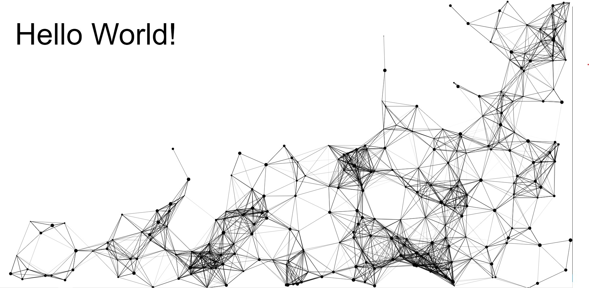
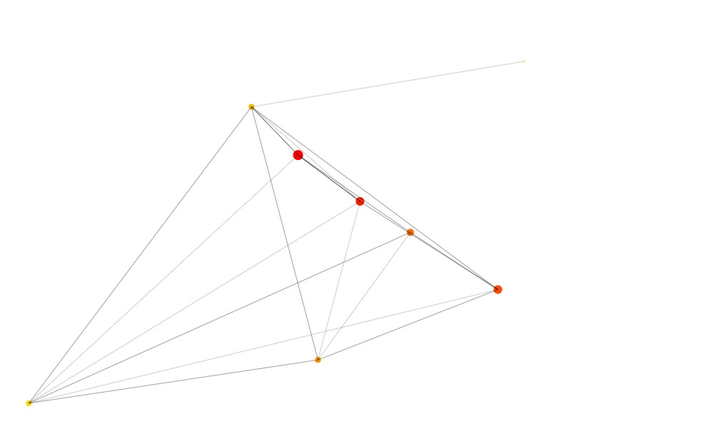

# Nuerons animation
Dots are running away from the mouse cursor and are linking with each other when they are close enough (the link is thicker the closer they are).
Neurons animation effect done with javascript in two versions:
* with border to move dots out from the place for text, 
* representing neuron network: size of dot corresponds to number of connections of the node with color from generating gradient palete.

